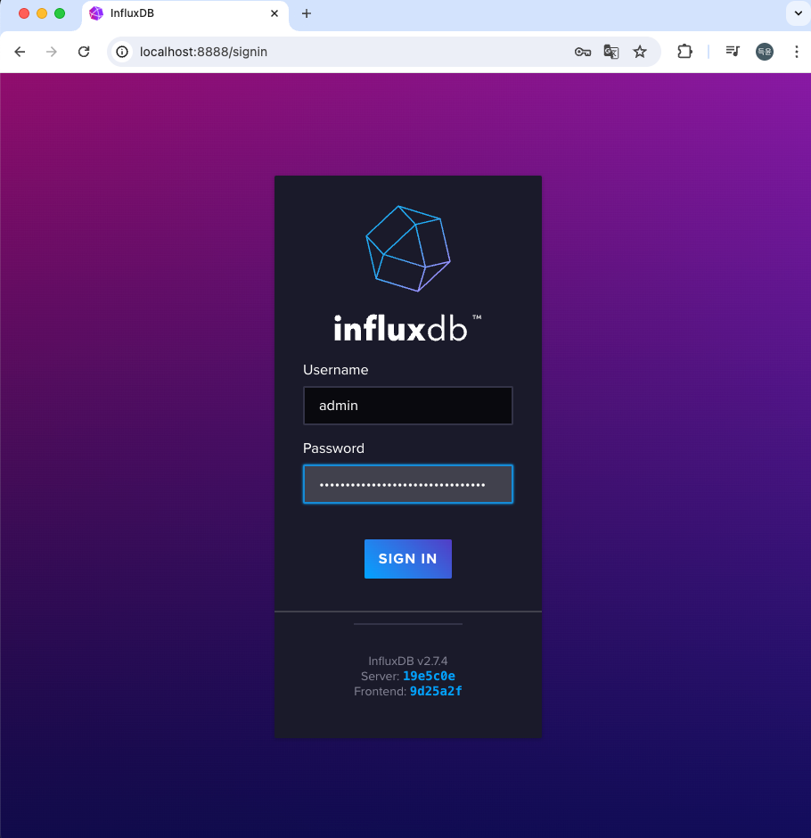

# helm-influxdb

## Get Chart

```bash
helm repo add influxdata https://helm.influxdata.com/
helm fetch influxdata/influxdb2 --untar
```

see https://github.com/influxdata/helm-charts

## Helm Install

```bash
kubectl create namespace influxdata
helm install -n influxdata influxdb influxdb
```

## Check Installation

```bash
# To retrieve the password for the 'admin' user
echo $(kubectl get secret influxdb-influxdb2-auth -o "jsonpath={.data['admin-password']}" --namespace influxdata | base64 --decode)

# port-forward to portal
kubectl port-forward -n influxdata svc/influxdb-influxdb2 8888:80
```


