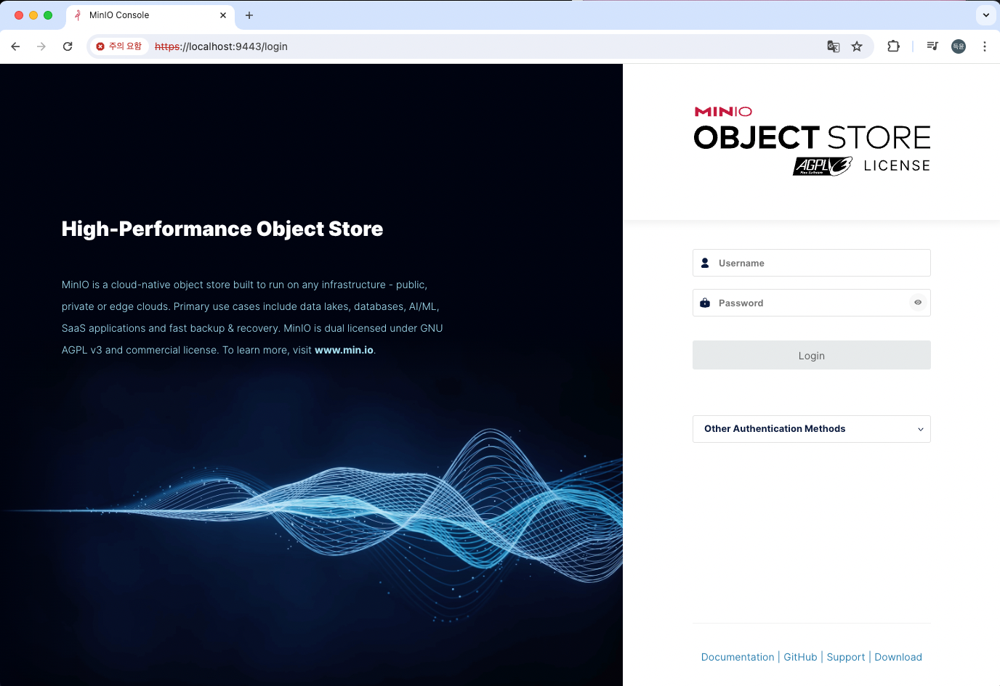
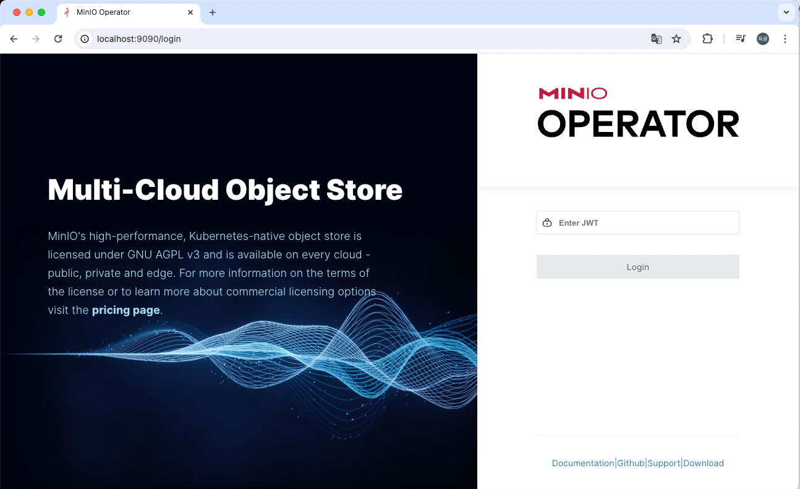

# helm-minio

## Get Chart

```bash
helm repo add minio https://operator.min.io/
helm fetch minio/operator --untar
helm fetch minio/tenant --untar
```

or download from https://github.com/minio/operator/tree/master/helm-releases

## Helm Install

run a `mc` pod

```bash
kubectl run my-mc -i --tty --image minio/mc:latest --command -- bash
```

```bash
kubectl create namespace minio
helm install -n minio operator operator -f values.operator.yaml
helm install -n minio tenant tenant -f values.tenant.yaml
```

## Port-Forward

port-forward minio-api

```bash
kubectl  port-forward -n minio svc/minio 9000:443
```

port-forward minio-console

```bash
kubectl  port-forward -n minio svc/tenant-console 9443:9443
```

port-forward operator-console

```bash
kubectl  port-forward -n minio svc/console 9090:9090
```

## Check Installation

- minio-api

requires `mc` - https://github.com/minio/mc

```
╭─deukyun@namdeug-yun-ui-Macmini ~
╰─$ mc admin info --insecure local/
●  127.0.0.1:9000
   Uptime: 31 minutes
   Version: 2024-03-15T01:07:19Z
   Network: 1/1 OK
   Drives: 4/4 OK
   Pool: 1

Pools:
   1st, Erasure sets: 1, Drives per erasure set: 4

0 B Used, 1 Bucket, 0 Objects
4 drives online, 0 drives offline
```

- minio-console

enter localhost:9443 on browser



- operator-console

enter localhost:9090 on browser

